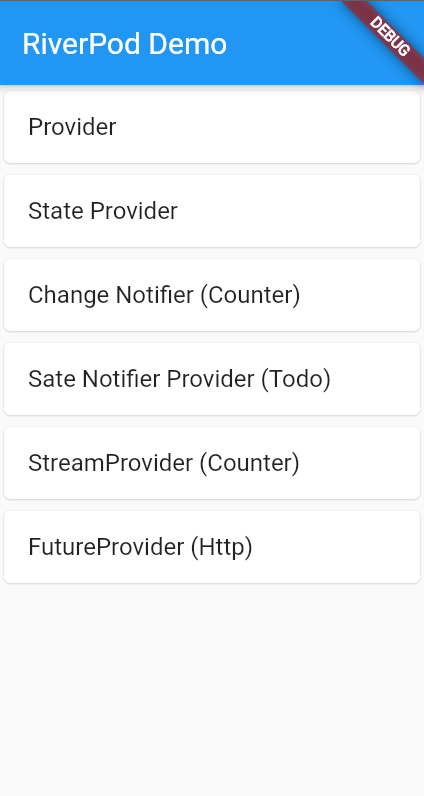

# riverpod_getting_started

## In this project,
 I'm exploring the popular riverpod
 state manegment solution.

My Main Source of Understanding the different provider is,
[riverpod-state-management-explained](https://www.refactord.com/guides/riverpod-state-management-explained)

## Want to Getting Start With Flutter

This project is a starting point for a Flutter application.

A few resources to get you started if this is your first Flutter project:

- [Lab: Write your first Flutter app](https://flutter.dev/docs/get-started/codelab)
- [Cookbook: Useful Flutter samples](https://flutter.dev/docs/cookbook)

For help getting started with Flutter, view our
[online documentation](https://flutter.dev/docs), which offers tutorials,
samples, guidance on mobile development, and a full API reference.
